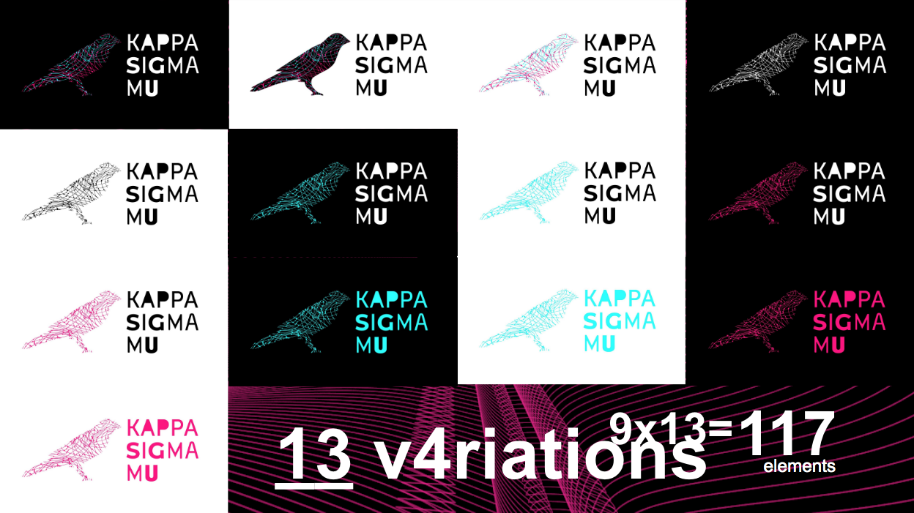
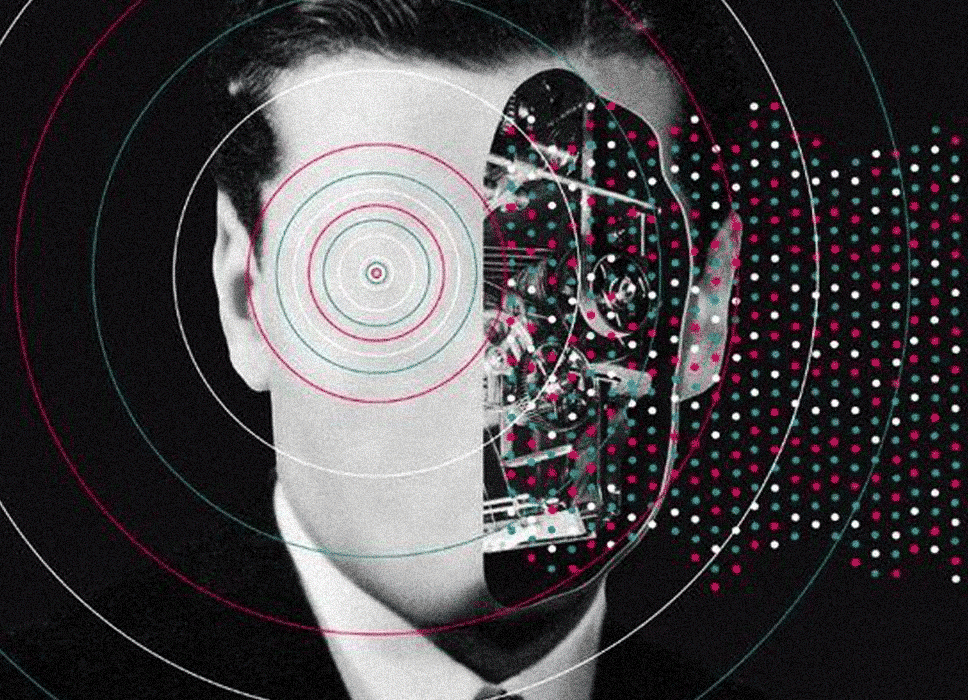

## 202105

[Vision Document](https://drive.google.com/drive/u/2/folders/1ReG63yRvPgIRRyryDTbrACHELcZoMkA3)

### 20210510

[Showcase week 4](https://drive.google.com/drive/u/2/folders/1ReG63yRvPgIRRyryDTbrACHELcZoMkA3)

### 20210503

We started the development of [this release](https://github.com/KappaSigmaMu/kappasigmamu.github.io). Initially just with web references and release notes for the branding work. The portal development starts on June, 2021.

 <iframe title="canario_3d" frameborder="0" allowfullscreen mozallowfullscreen="true" webkitallowfullscreen="true" allow="fullscreen; autoplay; vr" xr-spatial-tracking execution-while-out-of-viewport execution-while-not-rendered web-share width="640" height="480" src="https://sketchfab.com/models/93590a6310184eaa888666a1e43b01a5/embed?ui_theme=dark"> </iframe> 
 <a href="https://sketchfab.com/3d-models/canario-3d-93590a6310184eaa888666a1e43b01a5?utm_medium=embed&utm_campaign=share-popup&utm_content=93590a6310184eaa888666a1e43b01a5" target="_blank" style="font-weight: bold; color: #1CAAD9;"> canario_3d </a> by <a href="https://sketchfab.com/laurogripa?utm_medium=embed&utm_campaign=share-popup&utm_content=93590a6310184eaa888666a1e43b01a5" target="_blank" style="font-weight: bold; color: #1CAAD9;"> laurogripa </a> on <a href="https://sketchfab.com?utm_medium=embed&utm_campaign=share-popup&utm_content=93590a6310184eaa888666a1e43b01a5" target="_blank" style="font-weight: bold; color: #1CAAD9;">Sketchfab</a>

## 202104

In April we started the branding work, doing research and testing textures in the 3D canary. During this month we also started some technology exploration of IPFS, integration with the Kusama RPC, and Polkadot React components tests.

### 20210430]

[GitHub organization](https://gi[thub.com/KappaSigmaMu) created.

### 20210422

Started exploring variations of the canary and typography for the brand.

[Showcase week 2](https://drive.google.com/file/d/1eb5Eb8Rq0a-GXYz32f_7RHE8IjQJiava/view?usp=sharing)

### 20210415

Started the study of references for the Kappa Sigma Mu brand. [See presentation](https://docs.google.com/presentation/d/1bv9kYMQ-BcBpXQUDM78fsWtPxSqmWFIC/edit).

### 20210408

See the [Showcase](https://drive.google.com/file/d/1A1H6Pdm8pGbxpCIxOMIAXu2ApSjHmg-g/view?usp=sharing) for this week.

### 20210404

Created [Trello board](https://trello.com/b/aqOYaoD0/brand-and-website) to coordinate the work.

## 202103

In March 2021, the Kusama Society (Kappa Sigma Mu Society) completed its first cycle of associations with 150 members admitted worldwide. KSM is a membership club using the Substrate Society pallet. It aims to make Kusama and its functionalities known to non-technical users, raise awareness on new forms of organization and identify the link between the onchain and offchain worlds. New Society candidates are judged on their ability to provide proof-of-ink to existing members.

The development of the Society was planned and approved back in mid-2020. We talked to the original proponents to understand what still needs to be done. The narrative is done (first milestone) and the brand is a work in progress (second milestone), but website development has not yet started. See the [original proposal](./assets/DotsToLines-KSMSocietyCollaborationTheKusamaHumanBlockchainProject.pdf).

In this context, we propose a roadmap to address brand development, marketing strategy and website development, assembling a team to work on them.

Take a look in the [online version](https://docs.google.com/document/d/1LvOR3-8U8m5b0b-yN41MDxZUBVAR09lroavtZ2VwRYo/edit), or in the [PDF backup](./assets/KusamaSpendingProposal-KappaSigmaMu-V1.pdf).

## 202008

The Society submitted its treasury proposal for the DotsToLines collaboration: The Human Blockchain Project. The proposal centres in community growth and education focused in the verge of technology and art – this particular submission covers:

* Narrative, marketing and comms outreach strategy and development;
* Brand development;
* Website development;
* Society treasury funding for new members, taking into account maker’s fee and candidate reward.

You can find the [original proposal doc here](https://drive.google.com/file/d/1q6kFyznrDnyctZViK29J2OvBrr4D1LNo/view?usp=sharingThe), or the take a look in the [PDF backup](./assets/DotsToLines-KSMSocietyCollaborationTheKusamaHumanBlockchainProject.pdf). Take a look in the [Motion #186](https://kusama.polkassembly.io/motion/186).

## 202011

The [Society Documentary](https://www.youtube.com/channel/UCEk1aTXtPgs31A-vQJ5kvjg) is releases.

<iframe width="560" height="315" src="https://www.youtube.com/embed/-JfQ2vCipWU" title="YouTube video player" frameborder="0" allow="accelerometer; autoplay; clipboard-write; encrypted-media; gyroscope; picture-in-picture" allowfullscreen></iframe>
