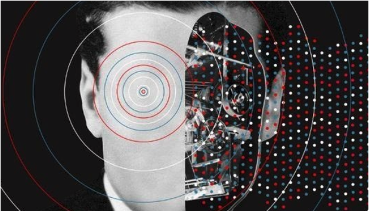

### 20210516

### 20210430

We are excited to share some developments of our brand and website.

### 202103

In March 2021, the Kusama Society (Kappa Sigma Mu Society) completed its first cycle of associations with 150 members admitted worldwide. KSM is a membership club using the Substrate Society pallet. It aims to make Kusama and its functionalities known to non-technical users, raise awareness on new forms of organization and identify the link between the onchain and offchain worlds. New Society candidates are judged on their ability to provide proof-of-ink to existing members.

The development of the Society was planned and approved back in mid-2020. We talked to the original proponents to understand what still needs to be done. The narrative is done (first milestone) and the brand is a work in progress (second milestone), but website development has not yet started. See the [original proposal](./assets/DotsToLines-KSMSocietyCollaborationTheKusamaHumanBlockchainProject.pdf).

In this context, we propose a roadmap to address brand development, marketing strategy and website development, assembling a team to work on them.

Take a look in the [online version](https://docs.google.com/document/d/1LvOR3-8U8m5b0b-yN41MDxZUBVAR09lroavtZ2VwRYo/edit), or in the [PDF backup](./assets/KusamaSpendingProposal-KappaSigmaMu-V1.pdf).

### 20200803 (block [3446181](https://polkascan.io/kusama/block/3446181))

The Society submitted its treasury proposal for the DotsToLines collaboration: The Human Blockchain Project. The proposal centres in community growth and education focused in the verge of technology and art – this particular submission covers:

* Narrative, marketing and comms outreach strategy and development;
* Brand development;
* Website development;
* Society treasury funding for new members, taking into account maker’s fee and candidate reward.

You can find the [original proposal doc here](https://drive.google.com/file/d/1q6kFyznrDnyctZViK29J2OvBrr4D1LNo/view?usp=sharingThe), or the take a look in the [PDF backup](./assets/DotsToLines-KSMSocietyCollaborationTheKusamaHumanBlockchainProject.pdf).

[#186 Motion](https://kusama.polkassembly.io/motion/186).

### 20201103

The Society Documentary is releases.

EMBED:
https://www.youtube.com/watch?v=-JfQ2vCipWU&t=4s

EMBED:
https://www.youtube.com/channel/UCEk1aTXtPgs31A-vQJ5kvjg
